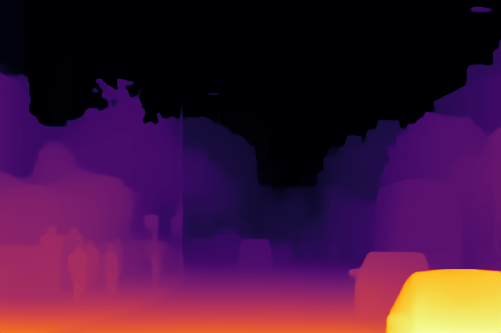
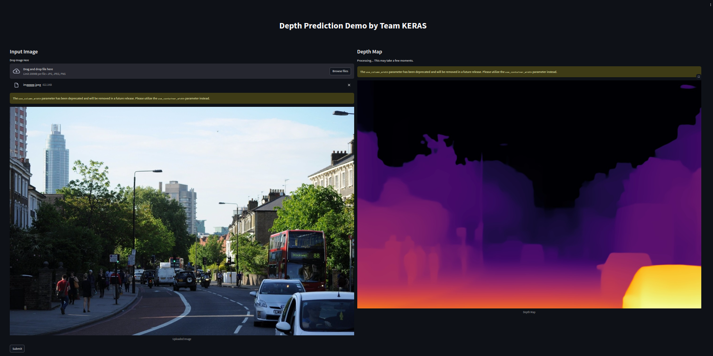

# Team Keras - Monocular Depth Estimation 

In this repository we prepared the solution for the **CVPR2024 Monocular Depth Estimation Challenge**, utilizing the **NYUv2 dataset** for training and evaluation. Our models achieve good performance on the challenge leaderboard.

## Overview of Model Inference

Our model predicts depth maps from monocular RGB images. Below is an example showing the input image and its corresponding depth prediction:

| Input Image                         | Predicted Depth Map                |
|-------------------------------------|-------------------------------------|
|   |     |

These results highlight the model's ability to infer depth information accurately and provide a visual representation of its performance.

---

## Dataset  
We use the **NYUv2 dataset** for training and evaluation. Follow these steps to prepare the dataset:

1. Create a directory for the dataset:
   ```bash
   mkdir nyu_depth_v2
   ```

2. Download the labeled data:
   ```bash
   wget http://horatio.cs.nyu.edu/mit/silberman/nyu_depth_v2/nyu_depth_v2_labeled.mat
   ```

3. Extract the official train and test splits:
   ```bash
   python extract_official_train_test_set_from_mat.py nyu_depth_v2_labeled.mat splits.mat ./nyu_depth_v2/official_splits/
   ```

4. Download `sync.zip` provided by the authors of BTS from [this link](https://drive.google.com/file/d/1AysroWpfISmm-yRFGBgFTrLy6FjQwvwP/view), and unzip it in the `./nyu_depth_v2` folder.

Your dataset directory should look like this:

```
nyu_depth_v2/
├──official_splits/
│  ├── test
│  ├── train
├──sync/
```

## Preprocessing
**Ensure and cross-verify the paths before running**
Here is the directory structure of the preprocessing directory
```
root/
├── preprocessing/
│   ├── img_preprocess.py
│   ├── img_augmentation.py
│   ├── preprocess.py
│   ├── vkitti.py
│   ├── diode.py
│   └── nyu_preprocess.py
```
Enter into the preprocessing directory to find the files
```bash
cd preprocessing
```
To arrange and organize files neatly based on file formats and map the color gradings to images run :
```bash
python preprocess.py
```
Ensure the dataset paths are correctly set in the `nyu_preprocess.py` file to preprocess the NYU dataset. For preprocessing, run:

```bash
python nyu_preprocess.py
```

Similarly, run the files for the diode and Vkitti datasets, found in the preprocessing folder, and ensure the paths are correctly set.

```bash
python diode.py
```
```bash
python vkitti.py
```

To standardize all the images into a single format of shape and size, and handle the borders and cropping etc run :

```bash
python img_preprocess.py
```
If you want to train on a particular type of data say indoor or outdoor and find data to be insufficient run augmentation techniques , run:


```bash
python img_augmentation.py
```


## Training  
Set up the configurations in the `train_mono.py` file. And to train the model, execute:  

```bash
python train_mono.py -m zoedepth -d nyu --pretrained_resource=""
```

---

## Inference  

We provide two options for inference:
1. **Whole Image Inference**: Uses `inference.py` for standard predictions.  
2. **Enhanced Edge Inference**: Uses `new_inference.py` with sliding window processing for improved edge accuracy.  

Set the appropriate paths in each script and run:  

### Whole Image Inference  
```bash
python inference.py
```

### Sliding Window Inference  
```bash
python new_inference.py
```

---

## Deployment

We have deployed the model as a web application that allows users to upload an image, and the model generates and displays the corresponding depth map.

### Depth Map Result

Below is a screenshot showing the predicted depth map after uploading an image:

| Depth Map Result               |
|---------------------------------|
|  |

**Step-by-Step Process**:
1. **Upload Image**: On the web interface, the user can upload an image of a scene.
2. **Get Depth Map**: After uploading, the model processes the image and displays the predicted depth map on the same page.


## Results  

### Final Leaderboard  
Performance metrics on the NYUv2 test dataset:  

| User           | Team Name    | F-Score (↑) |  MAE (↓)  | RMSE (↓) | AbsRel (↓) |
|----------------|--------------|-------------|----------|----------|-------------|
| Aditya0870     | Keras        | 21.3        |  4.1     | 10.9     | 18.7654     |

---
